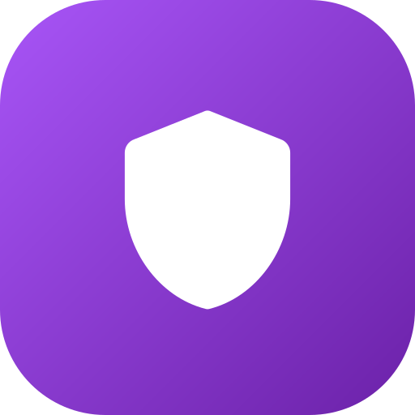

<div align="center">

  

  # NNN Shield

  Android app for NSFW content blocking and No Nut November challenge tracking.

</div>

---

## Overview

NNN Shield is an Android application designed for anyone looking to conquer No Nut November (or any dopamine reset and abstinence period) by minimizing the risk of impulsive relapses.

Instead of relying solely on willpower or a basic day counter, the app intervenes at the operating system level: it configures secure DNS with content filtering, provides a settings lockdown mechanism protected by a cryptographic time vault, and allows seamless integration with your home Pi-hole server.

It requires no root privileges and does not run a battery-draining local background VPN.

---

## Features

- **System Private DNS (DNS-over-TLS)**: Step-by-step guide to configure native Android Private DNS with CleanBrowsing, Cloudflare Family, or AdGuard. Filtering covers all system traffic (browsers, third-party apps, social media) on Wi-Fi and mobile data (4G/5G), with enforced SafeSearch on Google, Bing, and YouTube.
- **Cryptographic Time Vault (TimeVault)**: Powered by client-side 256-bit AES-GCM via the Web Cryptography API. Generates and seals administrative PINs or passwords that cannot be decrypted before the challenge's scheduled end date.
- **Pi-hole v6 Integration**: Native REST API v6 connection to automatically load over 100,000 prohibited domains into your Pi-hole Adlists. Optionally resets the Pi-hole admin password to a random 32-character string sealed inside the time vault until the end of the month.
- **External App-Locker Hardening**: Procedures to lock Android Settings using tools like AppBlock or StayFree. The app generates a random PIN to set on the blocker and archives it in the vault—preventing you from disabling DNS filters during moments of temptation.
- **Daily Check-in & DNS Sentinel**: Streak tracking requiring check-in before midnight, combined with periodic canary probes to verify that blocking remains active. Features a 2-hour initial grace period for DNS propagation and local cache clearing.
- **Emergency Panic Button (SOS Urge)**: One-tap instant access to rhythmic box breathing (4-4-4-4), physical reset counters (immediate pushups, 120s cold shower timer), and stoic philosophical truths.
- **Local Notifications & Stealth Mode**: Daily check-in reminders. Stealth Mode transforms lock-screen notifications into neutral system messages (e.g. sync confirmation) to protect your privacy from bystanders.
- **Material Design 3 Interface**: OLED-optimized dark theme with full edge-to-edge display support (zero black bars in the status bar or navigation bar).

---

## Installation (.apk)

The app is distributed as a direct APK. To install on your device:

1. Go to the **Releases** section of this repository and download the latest `.apk` file.
2. Open the downloaded file on your Android device. If prompted, allow installation from unknown sources for your browser or file manager.
3. Launch **NNN Shield** and follow the guided initial setup:
   - Choose challenge duration (30 days, 14 days, or 7 days).
   - Configure Android Private DNS.
   - Optional Pi-hole integration (REST API or manual adlists).
   - Generate and lock a PIN for your settings blocker app.
   - Run the canary diagnostic test to verify active DNS filtering.
   - Final cryptographic seal and transition to the dashboard.

---

## Privacy & Security

- **No Remote Backend**: Operates completely offline on your device. Zero cloud databases, user accounts, or proprietary servers.
- **Zero Tracking**: No analytics libraries, telemetry, crash reporting trackers, or ads.
- **Network Calls**: The only network requests made by the app are local requests to your Pi-hole IP (if configured) and canary probe tests directly against blocked test domains to verify active DNS resolution blocking.

---

## Building from Source

To build the application manually:

### Prerequisites
- Node.js 18+ and npm
- Android Studio with Android SDK (API 34) and JDK 17 or 21

### Procedure

1. Clone the repository and install dependencies:
   ```bash
   git clone https://github.com/icaro12123/nnn-shield.git
   cd nnn-shield
   npm install
   ```

2. Build the frontend bundle and sync the Android project:
   ```bash
   npm run build
   npx cap sync android
   ```

3. Open the project in Android Studio:
   ```bash
   npx cap open android
   ```

4. Generate the APK package:
   - **Debug**: menu *Build* > *Build Bundle(s) / APK(s)* > *Build APK(s)*.
   - **Signed Release**: menu *Build* > *Generate Signed Bundle / APK...* > select *APK*, provide your keystore, and build the *release* variant.

---

## License

Released under the MIT License. See [LICENSE](LICENSE) for details.
